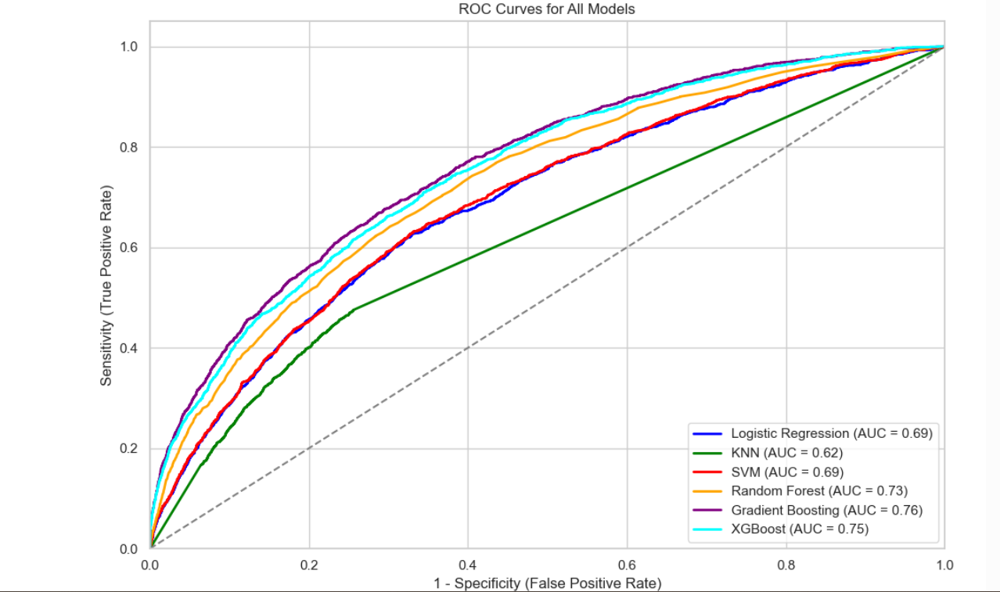

# child-mortality-prediction
A machine learning project to predict child mortality in India using NFHS data

# 🧒 Predicting Child Mortality in India using NFHS Data

This repository contains a machine learning project focused on predicting child mortality based on socio-demographic and health-related features. The dataset used is derived from the National Family Health Survey (NFHS), a large-scale and nationally representative survey conducted across India.

---

## 📘 Project Overview

Child mortality is a key public health metric. This project explores predictive modeling to classify whether a child survives based on various factors such as:

- Mother's age and education
- Wealth index and place of residence
- Religion and caste
- Birth order and spacing
- Contraceptive use and marital status

---

## 🔧 Techniques Used

- **Data preprocessing**: Missing value handling, outlier removal, scaling
- **Class imbalance correction**: SMOTE
- **Categorical encoding**: Label Encoding & One-Hot Encoding
- **Feature scaling**: Standardization
- **Modeling**:
  - Logistic Regression
  - K-Nearest Neighbors (KNN)
  - Support Vector Machine (SVM)
  - Random Forest
  - Gradient Boosting
  - XGBoost

- **Evaluation Metrics**: Accuracy, Precision, Recall, F1-Score, ROC-AUC
- **Feature Importance**: SHAP (for interpretability of XGBoost)

---

## 📁 Files in This Repository

| File | Description |
|------|-------------|
| `final_projcet.pdf` | Full report with methodology, results, and interpretation |
| `child_mortality_prediction.ipynb` | Python notebook with complete analysis, models, and visualizations |

---

## 🚀 Highlights

- **XGBoost** was the best-performing model with 93% accuracy and the highest AUC.
- Top predictors: number of children, mother's age, birth spacing, education, and wealth.
- Ensemble models outperformed simpler classifiers in both accuracy and recall.
- ### 📈 ROC Curve Comparison

---

## 🛠 Tools & Libraries

- `pandas`, `numpy`, `scikit-learn`, `xgboost`
- `matplotlib`, `seaborn`, `imblearn`, `shap`

